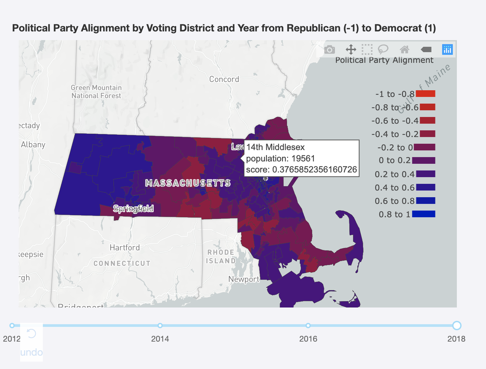

## Table of Contents
[Intro](https://github.com/SreejaKeesara/course-2019-spr-proj/tree/master/ldisalvo_skeesara_vidyaap#introduction)

[Datasets](https://github.com/SreejaKeesara/course-2019-spr-proj/tree/master/ldisalvo_skeesara_vidyaap#datasets)

[Transformations](https://github.com/SreejaKeesara/course-2019-spr-proj/tree/master/ldisalvo_skeesara_vidyaap#transformations)

[Analysis Techniques](https://github.com/SreejaKeesara/course-2019-spr-proj/tree/master/ldisalvo_skeesara_vidyaap#analysis-techniques)

[Conclusion](https://github.com/SreejaKeesara/course-2019-spr-proj/tree/master/ldisalvo_skeesara_vidyaap#conclusion)

[Visualization](https://github.com/SreejaKeesara/course-2019-spr-proj/tree/master/ldisalvo_skeesara_vidyaap#visualization)

[Future Work](https://github.com/SreejaKeesara/course-2019-spr-proj/tree/master/ldisalvo_skeesara_vidyaap#future-work)

[Additional Python Libraries](https://github.com/SreejaKeesara/course-2019-spr-proj/tree/master/ldisalvo_skeesara_vidyaap#additional-python-libraries)


# Political Ideology Mapping of Massachusetts
Team Members: Vidya Akavoor, Lauren DiSalvo, Sreeja Keesara

Directory: ldisalvo_skeesara_vidyaap

## Introduction
Our research objective was to define and characterize the political ideology of voting districts in Massachusetts with a focus on state Senate and House elections. With the abundance of sources pertaining to election data, it can be difficult to identify patterns between different datasets. Our visualization combines and transforms multiple datasets to provide a holistic political view of voting districts within Massachusetts.

## Datasets
We gathered Massachusetts election data from a variety of sources and stored them in MongoDB. Below we describe the schema of each dataset that we produced.

### State House Elections
Description: Data about each Massachusetts General State House Election from 2000 to 2018

Source: http://electionstats.state.ma.us/elections/search/year_from:2000/year_to:2018/office_id:8/stage:General

Table Name: stateHouseElections
```
{
    "_id" : "131672",
    "year" : 2018,
    "district" : "3rd Bristol",
    "candidates" :
    [ {
        "name" : "Shaunna L. O'Connell",
        "party" : "Republican",
        "isWinner" : true
    },
    {
        "name" : "Emily Jm Farrer",
        "party" : "Democratic",
        "isWinner" : false
    } ]
}
```
### State House Elections Results
Description: Data about voting results for each Massachusetts General State House Election from 2000 to 2018

Source: http://electionstats.state.ma.us/elections/download/131581/precincts_include:1/

Table Name: stateHouseElectionsResults
```
{
    "City/Town" : "Barnstable",
    "Ward" : "-",
    "Pct" : "7",
    "Election ID" : "131582",
    "William L Crocker, Jr" : 1079,
    "Paul J Cusack" : 1059,
    "All Others" : 5,
    "Blanks" : 42,
    "Total Votes Cast" : 2185
}
```
### State Senate Elections
Description: Data about each Massachusetts General State Senate Election from 2000 to 2018

Source: http://electionstats.state.ma.us/elections/search/year_from:2000/year_to:2018/office_id:9/stage:General

Table Name: stateSenateElections
```
{
    "_id" : "131666",
    "year" : 2018,
    "district" : "1st Middlesex",
    "candidates" :
    [ {
        "name" : "Edward J. Kennedy",
        "party" : "Democratic",
        "isWinner" : true
    }, {
        "name" : "John A. Macdonald",
        "party" : "Republican",
        "isWinner" : false
    } ] 
}
```
### State Senate Elections Results
Description: Data about voting results for each Massachusetts General State Senate Election from 2000 to 2018

Source: http://electionstats.state.ma.us/elections/download/131526/precincts_include:1/

Table Name: stateSenateElectionsResults

```
{
    "City/Town" : "Egremont",
    "Ward" : "-",
    "Pct" : "1",
    "Election ID" : "131526",
    "Adam G Hinds" : 682,
    "All Others" : 0,
    "Blanks" : 111,
    "Total Votes Cast" : 793
}
```

### Demographic Data County
Description: Demographic data for Massachusetts by county from census.gov, to see full list of fields, go to:
 
Source: https://www.census.gov/quickfacts/fact/table/ma/PST045217

Table Name: demographicDataCounty
```
{ "Barnstable County, Massachusetts":
   "Population estimates, July 1, 2017,  (V2017)": "213,444",
   "Population estimates base, April 1, 2010,  (V2017)": "215,868",
   "Population, percent change - April 1, 2010 (estimates base) to July 1, 2017,  (V2017)": "-1.1%",
   "Population, Census, April 1, 2010": "215,888",
   "Persons under 5 years, percent": "3.6%",
   "Persons under 18 years, percent": "15.1%",
   ..........................
}
```

### Demographic Data Town
Description: Demographic data for Massachusetts by city and town from census.gov and includes the data retrieved from demographicDataCity, to see full list of fields, go to:

Source: https://www.census.gov/quickfacts/fact/table/ma/PST045217)

Table Name: demographicDataTown
```
{ "Winchester town, Middlesex County, Massachusetts":
  "Population estimates, July 1, 2017,  (V2017)": "23,339",
  "Population estimates base, April 1, 2010,  (V2017)": "23,797",
  "Population, percent change - April 1, 2010 (estimates base) to July 1, 2017,  (V2017)": "-1.9%",
  "Population, Census, April 1, 2010": "23,793",
  ..........................
}
```

### Additional Datasets
The datasets below were not incorporated into our final visualization and analysis, but serve to provide more context in the problem space. Future work could incorporate these sources to provide a more detailed ideology mapping.

#### Ballot Questions
Description: Data about each Massachusetts Ballot Question from 2000 to 2018

Source: http://electionstats.state.ma.us/ballot_questions/search/year_from:2000/year_to:2018

Table Name: ballotQuestions
```
{
    "_id" : "7322",
    "year" : 2018,
    "number" : "4",
    "description" : "SUMMARY Sections 3 to 7 of Chapter 44B of the General Laws
        of Massachusetts, also known as the Community Preservation Act (the 'Act'),
        establishes a dedicated funding source for the: acquisition, creation and
        preservation of open space; acquisition, preservation, rehabilitation and
        restoration of hi...",
    "type" : "Local Question",
    "location" : "Various cities/towns"
}
```

#### Ballot Questions Results
Description: Data about voting results for each Massachusetts Ballot Question from 2000 to 2018

Source: http://electionstats.state.ma.us/ballot_questions/download/7303/precincts_include:1/

Table Name: ballotQuestionsResults
```
{
    "Locality" : "Bourne",
    "Ward" : "-",
    "Pct" : "7",
    "Yes" : 375,
    "No" : 914,
    "Blanks" : 26,
    "Total Votes Cast" : 1315,
    "Question ID" : "7303"
}
```

#### County Shapes
Description: geoJSON data about each Massachusetts county (taken from Google Fusion Table and uploaded to datamechanics.io)

Source: http://datamechanics.io/data/massachusetts_counties.csv

Table Name: countyShapes
```
{
    "_id" : "7322",
    "Name" : Barnstable,
    "Shape" : "<Polygon> ... ",
    "Geo_ID" : "25001",
}
```

## Transformations
The above datasets were combined to score the ideologies of voting districts within Massachusetts. The election data identified which political party the district's residents typically vote for. The demographic census data determined predictors of voting patterns within each voting district. 

### House District Ideology
Table Name: houseDistrictIdeology

Calculates a basic ideology score for each state house electoral district (160) by counting number of Democratic and Republican wins from 2000 to 2018

```
{
    "district" : "1st Barnstable",
    "percentDem" : 25,
    "percentRepub" : 75,
    "numDemWins" : 1,
    "numRepubWins" : 3,
    "numElections" : 4
}
```

### Senate District Ideology
Table Name: senateDistrictIdeology

Calculates a basic ideology score for each state senate electoral district (51) by counting number of Democratic and Republican wins from 2000 to 2018

```
{
    "district" : "1st Hampden and Hampshire",
    "percentDem" : 70, 
    "percentRepub" : 30, 
    "numDemWins" : 7,
    "numRepubWins" : 3, 
    "numElections" : 10 
}

```
### Weighted House Ideology
Table Name: weightedHouseIdeology

Calculates a weighted ideology score for each state house electoral district by creating a ratio of type of vote to total vote in each year and finding the average

```
{
    "district" : "1st Hampden and Hampshire",
    "Democratic ratio" : .6,
    "Republican ratio" : .2,
    "Others ratio" : .1,
    "Blanks ratios" : .1,
    "Average ratio": .2,
    "Totals" : 1
}

```

### Weighted Senate Ideology
Table Name: weightedSenateIdeology

Calculates a weighted ideology score for each state senate electoral district by creating a ratio of type of vote to total vote in each year and finding the average

```
{
    "district" : "1st Hampden and Hampshire",
    "Democratic ratio" : .6,
    "Republican ratio" : .2,
    "Others ratio" : .1,
    "Blanks ratios" : .1,
    "Average ratio": .2,
    "Totals" : 1
}

```


### Historical Voting Ideology in House Elections
Table Name: historicalRatiosHouse

Calculates and stores the weighted ideology score for each state house electoral district by year.  For each year, there is an entry in this table containing the ideology score of each district in that year. NOTE: This score only reflects Republican and Democratic numbers, not “Others” and “Blanks.”

```
{
    "year" : 2017,
    "15th Suffolk" : .6,
    "3rd Hampshire" : .3,
    ...
}


```

### Historical Voting Ideology in Senate Elections
Table Name: historicalRatiosSenate

Calculates and stores the weighted ideology score for each state senate electoral district by year.  For each year, there is an entry in this table containing the ideology score of each district in that year. NOTE: This score only reflects Republican and Democratic numbers, not “Others” and “Blanks.”

```
{
    "year" : 2017,
    "15th Suffolk" : .6,
    "3rd Hampshire" : .3,
    ...
}

```
### Demographic Summary Metrics
Table Name: summaryDemographicsMetrics

Retrieves summary demographic data for all facts by county and town. Displays maximum and minimum values and corresponding towns for each fact.
```
{
    'Fact': 'Population estimates, July 1, 2017,  (V2017)',
    'Town_Min': 'Middleton town, Essex County, Massachusetts',
    'Town_Min_Val': '9,861',
    'Town_Max': 'Littleton town, Middlesex County, Massachusetts',
    'Town_Max_Value': '10,115',
    'County_Min': 'Worcester County, Massachusetts',
    'County_Min_Val': '826,116',
    'County_Max': 'Middlesex County, Massachusetts',
    'County_Max_Value': '1,602,947'}
}

```

### Voting District Towns
Table Name: votingDistrictTowns

Maps voting district for state senate and house races to the list of towns in each district.
```
{
    "Type" : "Senate",
    "District" : "2nd Middlesex and Norfolk",
    "Towns" : [ "Ashland", "Framingham", "Franklin", "Holliston", "Hopkinton", "Medway", "Natick" ]
}

```

### Average Demographics by House District
Table Name: demographicDataDistrictHouse

Retrieves average demographic data by house district for Massachusetts.
```
     {  "House District" : "10th Bristol" ,
        "Population estimates, July 1, 2017,  (V2017)" : 64728,
        "Population estimates base, April 1, 2010,  (V2017)" : 64552,
        "Population, Census, April 1, 2010" : 64552,
        ..........................
     }
```

### Average Demographics by Senate District
Table Name: demographicDataDistrictSenate

Retrieves average demographic data by senate district for Massachusetts.
```
     {  "Senate District" : "2nd Middlesex and Norfolk" 
        "Population estimates, July 1, 2017,  (V2017)" : 29299.571428571428, 
        "Population estimates base, April 1, 2010,  (V2017)" : 27253, 
        "Population, Census, April 1, 2010" : 27253.714285714286, 
        "Persons under 5 years, percent" : 5.985714285714286,  }
        ..........................
     }
```

## Analysis Techniques
After our initial data transformations, we completed a more in-depth analysis to create a profile of local voting districts in Massachusetts that allows campaigns or political groups to determine which neighborhoods to canvass in.

To do this, we created demographic profiles of each voting district.  We created the table, votingDistrictTowns, which gives us all the towns in each district.  The districts are classified as either State Senate or House districts.  Using this table and the demographicDataTown table we created the demographicDataDistrictHouse and demographicDataDistrictSenate tables.  These two tables contain the demographic statistics for each district based on the average across the statistics from each town in a given district. Once we did the above, we were able to proceed with our statistical analysis and constraint satisfaction problems.

### Constraint Satisfaction
Given a budgeting constraint of X number of people that can be canvassed, we answered the question of which neighborhoods within the district can be visited without going over the total district budget. Each voting district consists of towns for which we have demographic data, including statistics about population, income, etc. 

We used the z3-Solver library to solve this constraint problem for each district. Each neighborhood within a district is a z3 variable that can either be assigned a 0 (do not canvass) or a 1 (canvass). The constraints use the population of each neighborhood to weight which ones to visit.

#### Canvassing Budget Constraint
Table Name: canvassingBudgetConstraint
Determines which towns within a voting district can be canvassed within a specified canvassing budget (in number of people).
```
{
    "District" : "2nd Middlesex and Norfolk",
    "Type" : "Senate",
    "Budget (# of people)" : 100000,
    "Check" : "sat",
    "Excluded Towns" : [ ],
    "Model" : [
                [ "Ashland", 1 ],
                [ "Framingham", 1 ],
                [ "Franklin", 0 ],
                [ "Holliston", 0 ],
                [ "Hopkinton", 0 ],
                [ "Medway", 0 ],
                [ "Natick", 0 ],
                [ "popNatick", 36246 ],
                [ "popMedway", 13329 ],
                [ "popHopkinton", 18035 ],
                [ "popHolliston", 14753 ],
                [ "popFranklin", 32996 ],
                [ "popFramingham", 72032 ],
                [ "popAshland", 17706 ]
            ]
}
```

### Statistical Analysis
In order to determine any strong predictors of voting ideology in Massachusetts, we created a table of correlation coefficients comparing demographic information and voting ideology. The coefficients compare each piece of demographic data with how Democratic and how Republican the districts are. A higher correlation coefficient indicates a stronger correlation between a given statistical metric and the likelihood of voting a certain way. 

Note: When trial mode is enabled, running time is cut from 2 minutes and 30 seconds to 28 seconds. 


#### Voting District Election Outcome Factors
Table Names: demographicHouseCorrelations, demographicSenateCorrelations
```
     {"_id" : ObjectId("5ca6479e3f7b1b6f24598da3"),
      "Party" : "Democratic", 
      "Population estimates, July 1, 2017,  (V2017)" : NaN, 
      "Population estimates base, April 1, 2010,  (V2017)" : NaN, 
      "Population, Census, April 1, 2010" : 0.35763757741202973, 
      "Persons under 5 years, percent" : 0.16158614409129984, 
      "Persons under 18 years, percent" : -0.24276258580942858, 
      "Persons 65 years and over, percent" : -0.15693780305590088,
      ...
      }
```

### Limitations
Constraint Solver: We were unable to construct a problem with multiple constraining factors. Specifically, we were interested in using the constraint solver to both determine which districts can be visited and optimize the funds allotted for canvassing in each district.


Data Source Changes: Because data was only available on government websites, our project was subject to issues when the data was updated or when the site itself was down, causing us to update our schema accordingly.
## Conclusion
Our data research consisted of the following steps: retrieval of data sets from online sources, transformation and manipulation of datasets, and analysis using statistical methods and constraint solvers. By doing this, we were successfully able to characterize the political ideology and demographic breakdown of voting districts in Massachusetts. 

We created a final visualization of the political ideologies of each voting district by shading a map of Massachusetts based on the ideology score we gave each district.  If a district is more strongly associated with voting for a specific party, it is shaded more darkly with that party’s color - blue for Democratic and red for Republican.  We created a profile of local political ideologies and demographics of voting districts within Massachusetts and provided an interactive model to explore how the political climate may have changed in recent years. We also created a tool to simulate the budgeting constraints of local campaigns. For example, users can alter the parameters to our canvassing budget problem and see if canvassing is more or less feasible in a given district.

After calculating the correlation coefficients for the demographic metrics, we were able to conclude what metrics had the strongest correlation in reference to a district voting either Democratic or Republican. 

The following five metrics were the most strongly correlated with voting Democratic in Massachusetts: two or more races, foreign born persons, language other than English spoken at home, persons without health insurance, and Asian alone. 

Furthermore, the following five metrics were the most strongly correlated with voting Republican in Massachusetts: White alone, living in the same house one year ago, White alone (not Hispanic or Latino), owner occupied housing unit rate, and Native Hawaiian and other Pacific Islander alone.


## Visualization
Outlined below is a user experience flow for our application.

On opening the application, the user can select between two tabs, “House” and “Senate,” that will change the second dropdown and map portions of our app.  By default, the app will open on the “House” tab that will populate one dropdown menu with all the graph types that the user can view and a second dropdown menu with the MA Senate voting districts.  On the left side of the app, the user will see a map that has the Senate voting districts shaded by ideology and on the right, the user will see a racial breakdown of the default district, “Berkshire, Hampshire and Franklin.”  The user can select from the two drop down menus which district they would like to learn about and which visual they want to see.  The available visual types are “Racial Breakdown,” “Metrics Most Correlated to Political Ideology,” “Firms Ownership Breakdown,” and “Canvassing Budget Plan.”  On the “Canvassing Budget Plan” visual, the user can input a proposed budget for the number of people they want to canvass in a district, and see which towns they would be able to visit under that constraint.  On the left side, under the map, is a slider that can be used to view the map at different points in time from 2010 to 2018.

See the below video and pictures for more details.<br>




To run visualization, first make sure that all python libraries in requirements.txt are installed. Make sure that your mongo database is running:
```
mongod --auth --dbpath "<your db path>"
```

Then run all the scripts in our team folder:
```
python3.7 execute.py ldisalvo_skeesara_vidyaap
```

Then run app.py. The easiest way to do this is on PyCharm by right-clicking on the file name and selecting 'run'. The application should be available at your default local host address.

## Future Work
A possible next step is to expand our visualization to include all fifty states. Users would have the option of viewing an individual state's election or national election results. We could also add more graph visualizations per district and state and provide users with the ability to compare multiple districts or states at the same time.

A future version of the app could enable accessibility features such as high-contrast visuals, ability to change the color scheme, text-to-speech, and the ability to enlarge visuals easily.

## Additional Python Libraries
You may need to import the following libraries to access our datasets: bs4, pandas, requests, csv, io

They can be installed by running the requirements.txt file

```
pip3 install requirements.txt
```

If you get a 'SSL: CERTIFICATE_VERIFY_FAILED' error, you need to install certificates for your version of Python. In MacOS, navigate to Finder->Applications->Python3.7 and double click on 'InstallCertificates.command' and then on 'UpdateShellProfile.command'.
